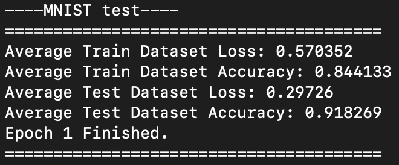
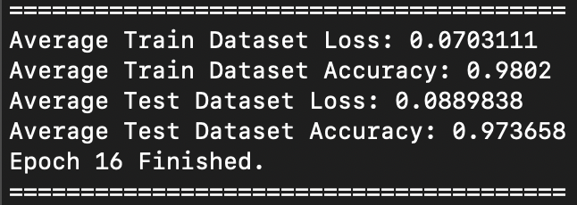

# Deep Learning Engine in C++

A deep learning framework built entirely from scratch in C++, including reverse mode automatic differentiation, tensor operations such as matmul and broadcasting, a small neural network module system, an optimizer, and a data loader for MNIST. No PyTorch, no TensorFlow, no external machine learning libraries. Just C++17 and the standard library.

## What This Project Does

This engine implements the core machinery that frameworks like PyTorch are built on, written by hand to understand exactly how it works underneath.

It includes:

- A Tensor class that supports matrix multiplication, broadcasting addition, and elementwise operations such as ReLU
- A reverse mode automatic differentiation engine. Every operation builds a node in a computation graph, and calling backward on a final tensor triggers a topological sort instead of dfs in order to prevent stack overflow for large neural networks, followed by execution of each node in the correct dependency order, accumulating gradients along the way
- A small neural network module system, with a shared Module interface and implementations for the Linear and ReLU layers, plus a Sequential container that chains modules together and collects their parameters automatically
- Softmax combined with cross entropy loss, implemented as a single fused operation for numerical stability and a clean gradient through (pred-target)
- He initialization for weights, which keeps ReLU activations healthy during training and avoids the dying neuron problem that comes from naive random initialization
- A basic SGD optimizer that updates parameters using their accumulated gradients and learning rate
- A CSV based data loader for MNIST that handles shuffling, batching, and one hot encoding of labels
- An end to end training loop that trains a small multilayer perceptron on the full MNIST training set and evaluates it on a held out test set

## Architecture

Everything in this engine is built around the Tensor class. Tensors own their own data as a flat vector for a more cache friendly memory layout rather than nested vectors that would require excessive memory lookups. Every tensor that participates in training is wrapped in a shared_ptr, which allows backward nodes to safely hold references to the tensors that created them without ever copying data they should not own.

When an operation like matmul or add is called on tensors that require gradients, the operation builds a backward node and attaches it to the resulting tensor. These backward nodes form a graph that mirrors the forward computation. Calling backward on the final output walks this graph in reverse, using a queue based topological sort to make sure every node only runs after all of its dependents have already contributed their gradient.

The neural network layer on top of this follows the same pattern used by real frameworks. A Module is anything with a forward method and a parameters method. Linear owns its own weight and bias tensors and updates them during training. ReLU has no learnable parameters of its own. It simply gates gradient flow based on which values were positive during the forward pass. Sequential chains any list of modules together and flattens all of their parameters into a single list that the optimizer can update.

## Results

After training a three layer network with 128 hidden units and 64 hidden units on the full MNIST training set of 60000 images, the model reaches roughly 89 percent accuracy on a held out test set of 10000 images. Training accuracy and test accuracy stay close to each other throughout training, which means the model is generalizing reasonably well rather than memorizing the training set.

Test accuracy starts around **91%** after the first epoch and climbs steadily climbs to **97%** as training continues.




## Building and Running

This project uses CMake and requires a C++17 compiler.

```
mkdir build
cd build
cmake .. -DCMAKE_BUILD_TYPE=Release
make
./run_engine
```

Building in release mode matters quite a bit here, since the matrix multiplication is a straightforward triple nested loop rather than a heavily optimized routine. An unoptimized debug build will be noticeably slower on the full MNIST dataset.

To train on MNIST yourself, download mnist_train.csv and mnist_test.csv and update the file paths inside main.cpp to point to wherever you saved them.

## What I Learned Building This

A large part of this project was learning C++ memory ownership the hard way. Early on, backward nodes were storing copies of tensors instead of references to the originals, which meant gradients were silently accumulating on throwaway copies instead of the real parameters. Switching to shared_from_this fixed this, but introduced its own chain of consequences, since a const method returns a const shared pointer, which then required const correctness to propagate through backward node constructors and every getter they touched.

Another major lesson came from training instability on the softmax cross entropy loss. The first few attempts exploded into NaN or got stuck outputting the same prediction for every input. Part of this came from dying ReLU units combined with weight initialization that was simply too large for the network to recover from. Switching to He initialization, where weights are drawn from a normal distribution scaled by the number of incoming connections, fixed that piece and made training noticeably more stable.

The instability did not fully go away though, and the real remaining cause turned out to be an incorrect transpose inside the matmul backward pass. This one was especially hard to catch because it only showed up once softmax and cross entropy loss were added. Simpler tests using plain Linear layers and Sequential with mean squared error loss never exposed it, and the loss in those early softmax tests still appeared to go down, which made the gradients look correct even though they were not. It took a lot more careful checking before the transpose logic was actually fixed.

A separate and much trickier bug only showed up at larger batch sizes, where the program would segfault for no obvious reason. Batch size of one always worked fine, which ruled out a lot of the usual suspects. The actual cause was incorrect gradient accumulation during the backward pass for broadcasting, since broadcasting needs gradients summed across the batch dimension in a way that ordinary elementwise addition does not. Once that was handled correctly, training at any batch size became stable.

## Future Work

- An Adam optimizer to replace or supplement plain SGD
- A proper gradient checking utility
- Faster matrix multiplication using cache blocking instead of the current naive triple loop
- Convolutional layers for image specific architectures
- Saving and loading trained weights to disk
- A learning rate schedule that decays over the course of training

## Project Structure

```
include/             Header files for Tensor, Module, autograd nodes, and the data loader
src/Tensor.cpp        Core tensor operations and backward graph construction
src/autograd/ops/     Backward node implementations for each operation
src/nn/                Linear, ReLU, and Sequential module implementations
src/SGD.cpp            The optimizer
src/Dataloader.cpp     CSV parsing, batching, and shuffling for MNIST
src/utility.cpp        Accuracy calculation
main.cpp               Test blocks for individual components and the full MNIST training loop
```
